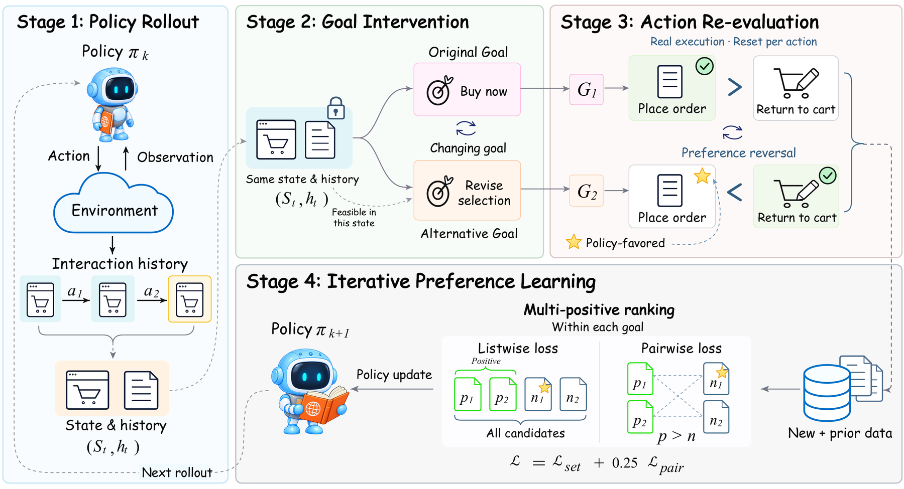
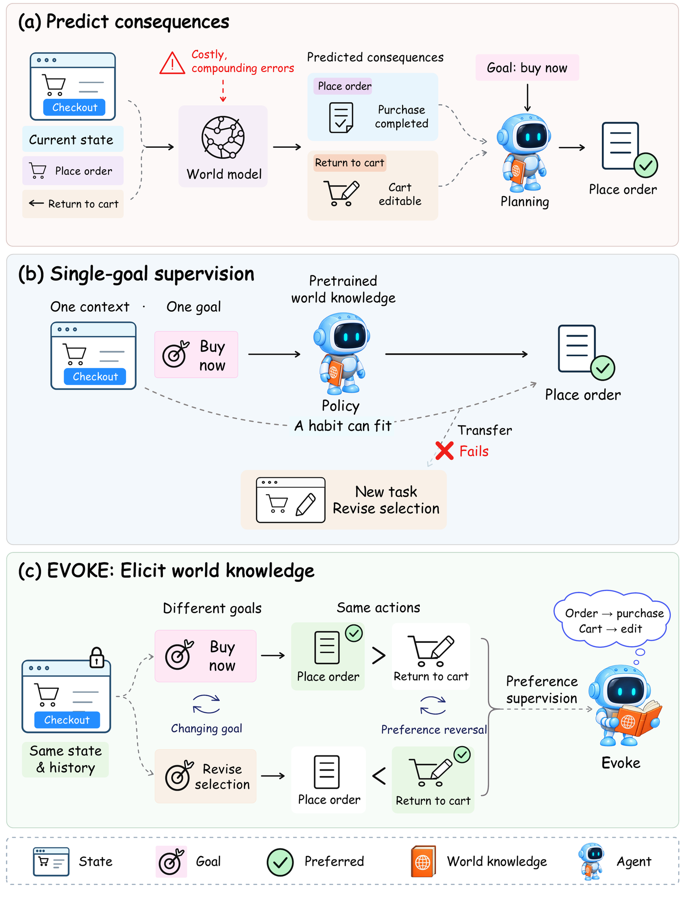
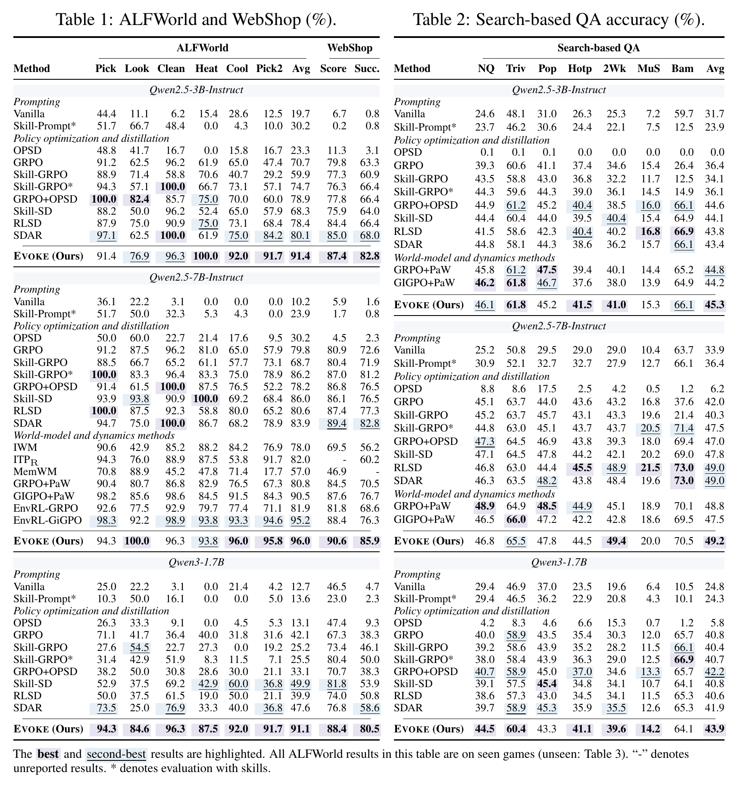
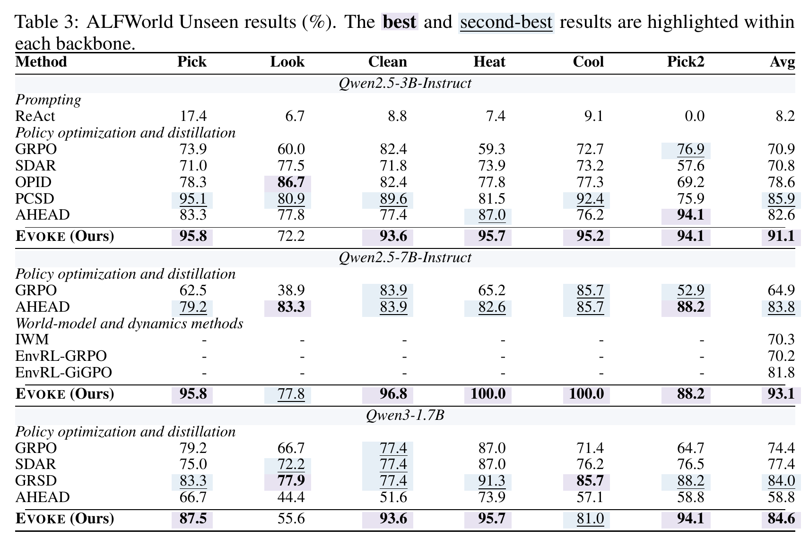
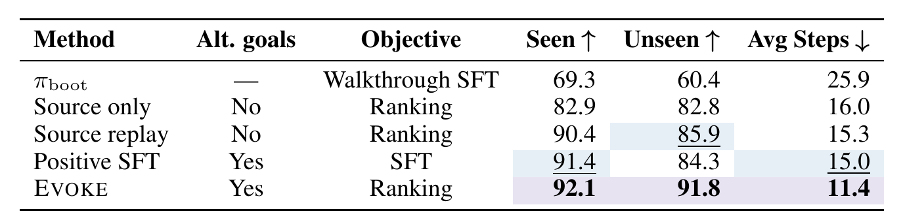
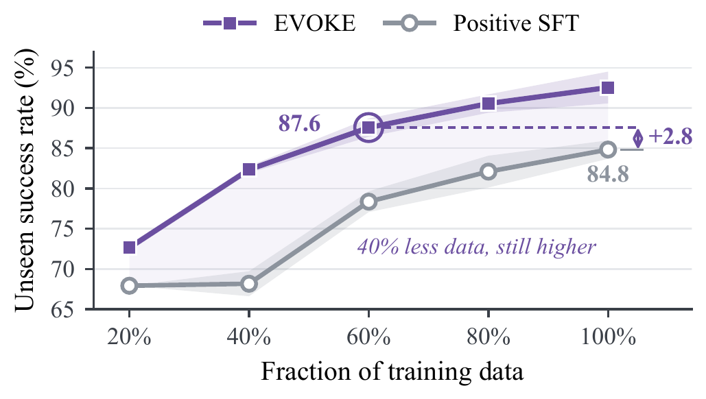
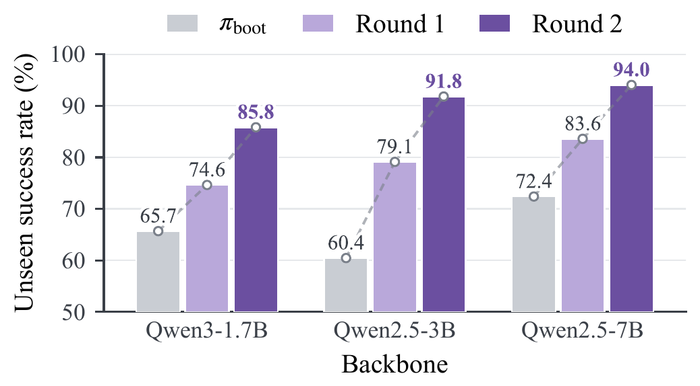
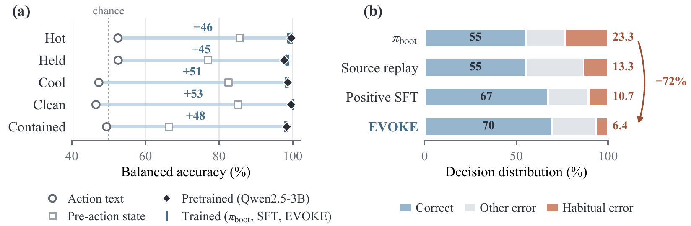
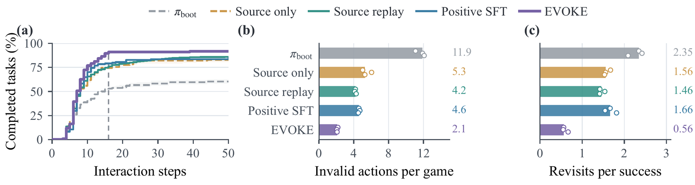

# 🌱 EVOKE: Eliciting World Knowledge in Agents for Transferable Decision-Making

**[📑 Paper](#-updates)** · **[💡 Motivation](#-motivation)** · **[📊 Results](#-results)** · **[📋 Release Plan](#-release-plan)** · **[📝 Citation](#-citation)**

---

**EVOKE** is a post-training method that elicits the world knowledge already inside pretrained LLM agents, so that they decide by the **consequences of their actions** rather than by contextual habits. It holds the state fixed, swaps in alternative goals, and trains the policy to rank the **same candidate actions** under each goal, with no world-model module and no inference-time planning.

  
   
  <em>The EVOKE training loop. At collected states, actions are executed and assessed under alternative goals with the state, history, and available actions fixed. The policy learns by contrastive ranking on aggregated preferences; actions can switch between positive and competing across goals.</em>

## 📰 Updates

- **`2026-09`**: 🏠 Repository created. Paper, code, models, and data are coming soon.

## ✨ Highlights

- 🚀 **Best across the board** — best average on ALFWorld, WebShop, and search-based QA with all three backbones.
- 🌍 **Transfers to unseen environments** — **91.1% / 93.1% / 84.6%** on unseen ALFWorld games (Qwen2.5-3B / 7B / Qwen3-1.7B).
- 🧠 **Elicits, not adds, knowledge** — the backbone already encodes action consequences; EVOKE makes the policy decide by the goal rather than by habit.

## 💡 Motivation

<table>
<tr>
<td width="50%"></td>
<td width="50%" valign="middle">

**Do agents need to *predict* consequences to use them?**

**(a) Predict consequences.** World models learn to predict future observations, adding cost and compounding errors in planning.

**(b) Single-goal supervision.** The knowledge is already in pretrained LLMs, but one goal per state lets the policy fit habits that fail to transfer.

**(c) EVOKE.** Change the goal at a fixed state. Preferences flip, so habits fail and the policy must use its knowledge of consequences.

</td>
</tr>
</table>

## 📊 Results

### Main Results

  
   
  <em>Main results on ALFWorld and WebShop (left) and search-based QA (right) across three backbones.</em>

  
   
  <em>Generalization to unseen ALFWorld games.</em>

### Analysis

All analyses use Qwen2.5-3B on ALFWorld unless noted.

  
   
  <em><b>Decision-supervision ablations.</b> Removing alternative goals or replacing ranking with imitation hurts unseen success. Micro success (%) and average unseen steps, averaged over training seeds.</em>

<table>
  <tr>
    <td width="50%" align="center"></td>
    <td width="50%" align="center"></td>
  </tr>
  <tr>
    <td align="center"><em><b>Data efficiency.</b> EVOKE outperforms SFT at every budget.</em></td>
    <td align="center"><em><b>Iterative improvement.</b> Every round improves every backbone.</em></td>
  </tr>
</table>

  
   
  <em><b>From knowledge to goal-directed decisions.</b> (a) Action consequences are linearly decodable before any ALFWorld training. (b) EVOKE makes the fewest habitual errors, i.e., choosing the action that is correct for another goal in the same context.</em>

  
   
  <em><b>Execution on unseen games.</b> EVOKE succeeds earlier and wastes fewer actions: (a) cumulative success over steps, (b) invalid actions per game, (c) revisits per successful game.</em>

## 📋 Release Plan

> **Last updated**: 2026-09-29

- [ ] Paper on arXiv
- [ ] Training and evaluation code (ALFWorld, WebShop, search-based QA)
- [ ] Trained models (LoRA adapters)
- [ ] Goal-intervention preference data
- [ ] Scripts to reproduce the main results and analyses

## 📝 Citation

The BibTeX entry will be added once the paper is available on arXiv.

## 📬 Contact

Questions and suggestions are welcome — please open an [issue](../../issues).
